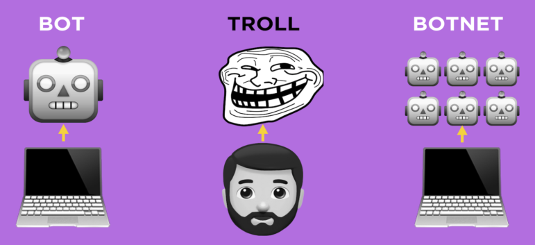
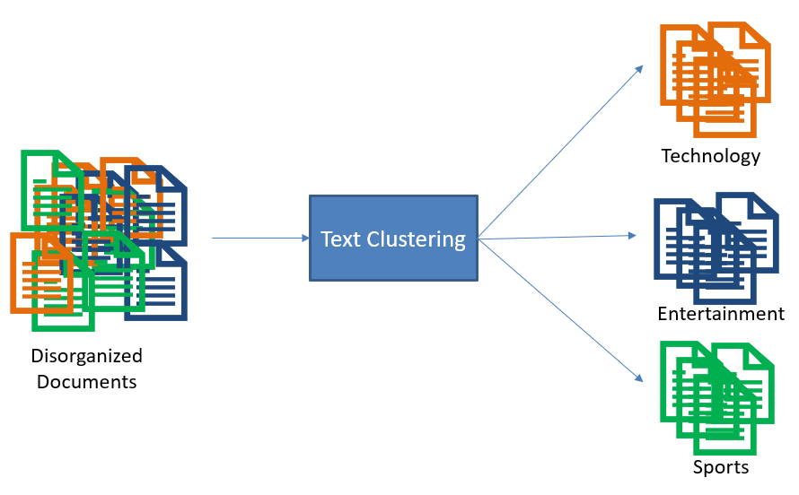
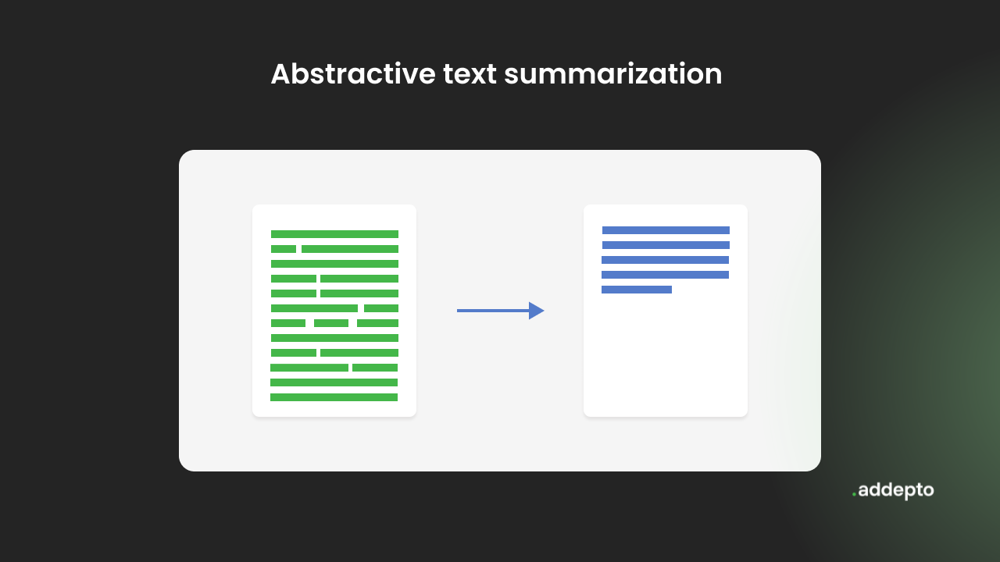
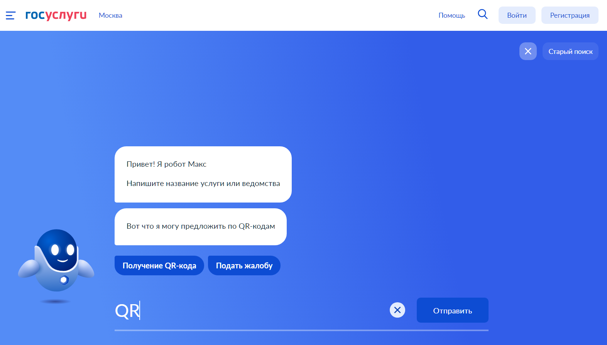

### Алгоритмы и анализ данных, 2025

# Задачи Natural Language Processing

Алексеев Илья

---

## Задачи

- классификация    
- тематическое моделирование
- распознавание сущностей
- генерация
    

---

# Классификация

- sentiment analysis
- spam detection
- toxicity detection

---

## Анализ эмоций (sentiment analysis)

---

## Детекция спама

---

## Детекция токсичности/ботов

---

# Тематическое моделирование

---

# Распознавание сущностей

---

# Генерация

- перевод
- суммаризация
- задачеориентировання диалоговая система
- ассистент/вопросно ответная система
- агент

---

## Перевод

---

## Суммаризация

---

## Задачеориентированная диалоговая система

---

## Вопросно-ответная система

---

## Агенты

