<style>
img[alt~="center"] {
  display: block;
  margin: 0 auto;
}
section::after {
  content: attr(data-marpit-pagination) '/' attr(data-marpit-pagination-total);
}
</style>

# Natural Language Processing

##### Сириус, "Алгоритмы и анализ данных" 2024

##### Алексеев Илья

Ключевые слова: embedding, recurrent neural network, transformer

---

## Outline

- Основы NLP
- Основы многомерной геометрии
- Обучение эмбедингов слов
- Добавление контекста с помощью RNN
- Механизм внимания в RNN
- Мезанизм самовнимания в Transformer

---

# Основы NLP

- векторизация текстов
- токенизация
- bag of words
- недостатки

---

## Векторизация текста

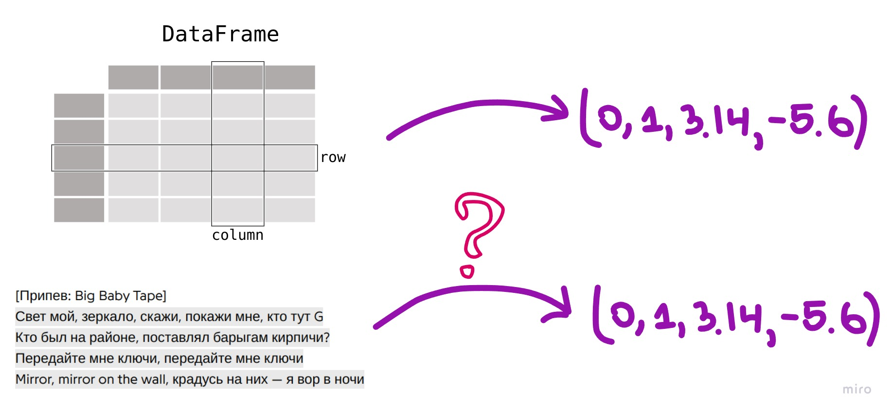

---

## Что такое текст?

Обучающая коллекция документов (текстов):
$$D = \{d_1, d_2 \ldots d_N \}$$

Документ:
$$d_i = (w_1, w_2, \ldots w_n),$$
где $w_i$ — токен (слово) из вокабулярия (словаря) $V$.

---

**Токенизация** — разделение текста на токены, элементарные единицы текста

В большинстве случае **токен  --- это слово***


Можно использовать специальные токенизаторы, например из
библиотеки `nltk`

---

### Word Tokenizer

```python
from nltk.tokenize import word_tokenize

example = 'Но не каждый хочет что-то исправлять:('
word_tokenize(example, language='russian')
```
```
['Но', 'не', 'каждый', 'хочет', 'что-то', 'исправлять', ':(']
```

---

## Sentence Tokenizer

```python
from nltk.tokenize import sent_tokenize

sent = 'Hey! Is Mr. Bing waiting for you?'
nltk.tokenize.sent_tokenize(sent)
```
```
['Hey!', 'Is Mr. Bing waiting for you?']
```

---

## Bag of Words (Count Vectorizer)

Предположим:
* Порядок токенов в тексте не важен
* Важно лишь сколько раз токен $w$ входит в текст $d$

Term-frequency, число вхождений слова в текст: $\text{tf}(w, d)$

Векторизация:
$$v(d) = (\text{tf}(w_{i}, d))_{i=1}^{|V|} $$

---
## Bag of Words (Count Vectorizer)


Конечный словарь со всеми возможными словами:

- `V = [пес, кот, сел, на, пень, ель]`

Пример векторизации:

| sentence | BoW |
|----------|-----|
| пес сел на пень | $[1,0,1,1,1,0]$ |
| кот сел на ель | $[0,1,1,1,0,1]$|

---

## Bag of Words (Count Vectorizer)

```python
from sklearn.feature_extraction.text import CountVectorizer

s = [
    'my name is Joe',
    'your name are Joe',
    'my father is Joe'
]
vectorizer = CountVectorizer()
vectorizer.fit_transform(s).toarray()
```

```
array([[0, 0, 1, 1, 1, 1, 0],
       [1, 0, 0, 1, 0, 1, 1],
       [0, 1, 1, 1, 1, 0, 0]])
```

---

## Недостатки

- Нет учёта контекста и порядка слов
- Огромное признаковое пространство (равное размеру словаря)

---

# Основы многомерной геометрии

- векторы
- функции метрик
- гипотеза компактности в ML

---

# Векторизация слов

- зачем нужна
- дистрибутивная гипотеза
- матрица совстречаемостей

---

## Мотивация

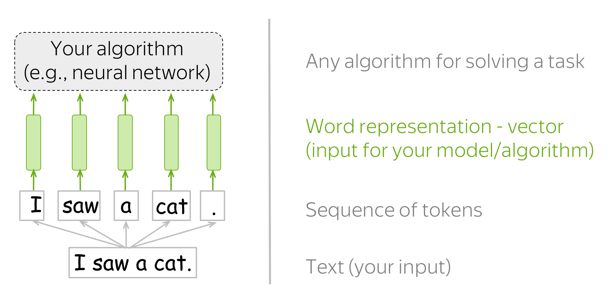

---

## Дистрибутивная гипотеза

Упрощенная формулировка:

### Похожие слова встречаются в похожих контекстах


---

## Матрица совстречаемостей

Для каждого слова считаем, сколько раз другие слова встретись с ним в одном окне.


---

## Матрица совстречаемостей

Для каждого слова считаем, сколько раз другие слова встретись с ним в одном окне.


---

## Матрица совстречаемостей

Для каждого слова считаем, сколько раз другие слова встретись с ним в одном окне.


---

## Матрица совстречаемостей

Для каждого слова считаем, сколько раз другие слова встретись с ним в одном окне.


---

## Матрица совстречаемостей

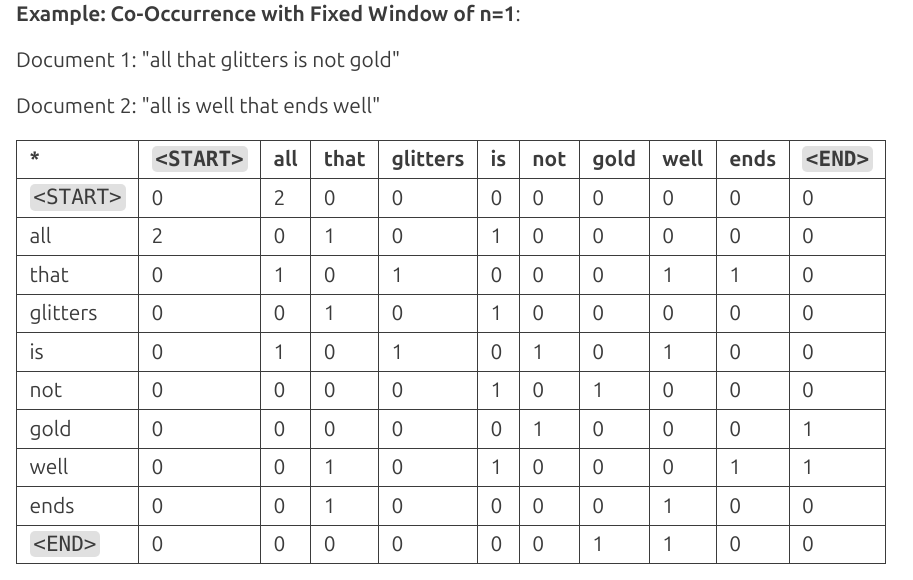

---

## Матрица совстречаемостей

Строка, соответствующая слову является его признаковым описанием (векторизацией)

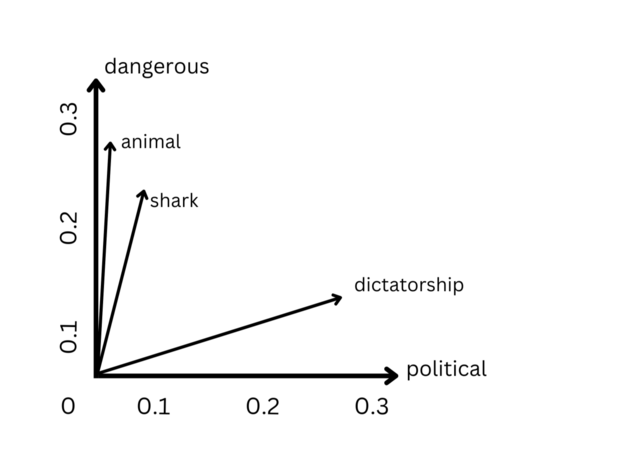

---

# Обучение эмбедингов слов

- контрастивная функция потерь
- классификация
- интерпретация и визуализация
- минусы (нет контекста)

---

## Матрица эмбедингов

Для каждого из $n$ слов в словаре инициализируем случайный эмбединг размера $d$. Получим матрицу $E\in\text{Mat}(n\times d)$.

Справа пример для $d=4$:

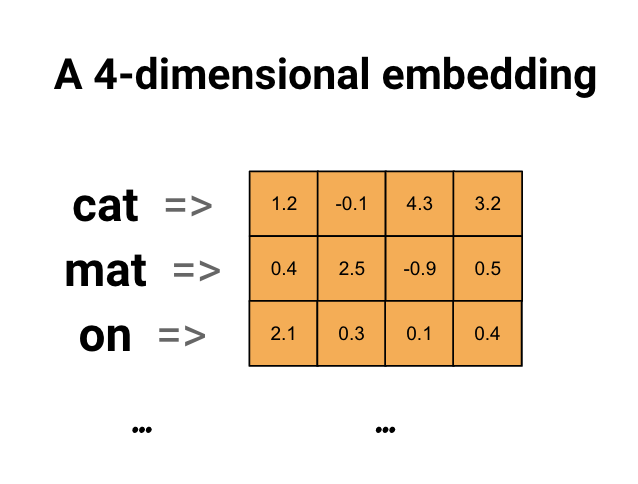

---

## Representation Learning

Давайте напрямую обучать метрическую близость между словами:

$$
\begin{align}
\text{maximize}\,&\cos(x,y)\\
\text{minimize}\,&\cos(x,z)
\end{align}
$$

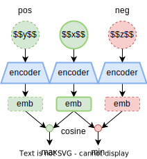

---

## Какие слова являются близкими или далекими?

---

## Иллюстрация


---

## Иллюстрация

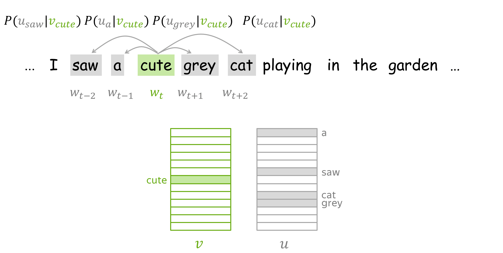

---

## Иллюстрация

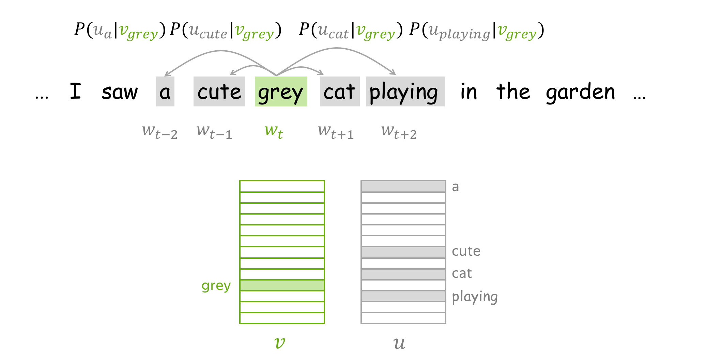

---

## Иллюстрация

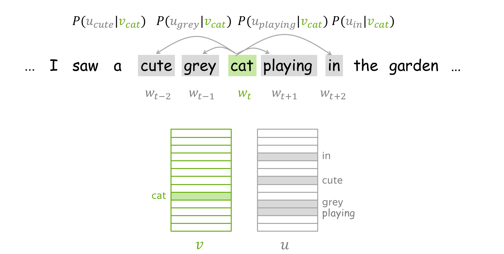

---

## Контрастивная функция потерь

Давайте напрямую обучать метрическую близость между словами:

$$
\mathcal{L}_i=-\log{\exp(\cos(x_i,y_i))\over\sum_j\exp(\cos(x_i,z_j))}.
$$


---

## Семантическая близость слов


---

## Семантическая близость слов

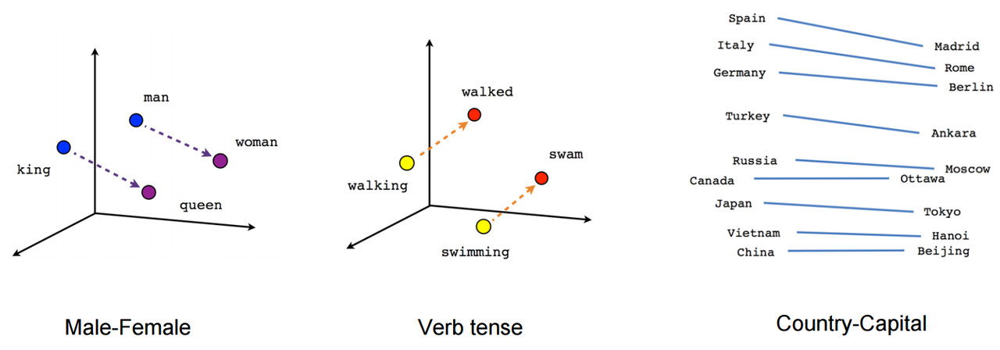

---

## Семантическая близость слов

https://lena-voita.github.io/nlp_course/word_embeddings.html#analysis_interpretability

---

# Рекуррентные нейронные сети (RNN)

- эмбединг всего текста
- transfer learning для эмбедингов слов
- проблема отсутствия контекста
- добавление рекуррентной связи
- задачи NLP
- стекинг слоев RNN

---

# Трансформеры

- механизм самовнимания
- BERT
- GPT

---

# Применение к другим доменам

- Audio
- CV
- Genetics

---

## Transformers in Audio

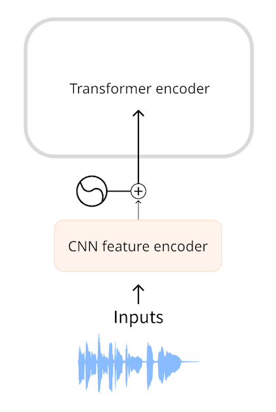

---

## Transformers in Computer Vision


---

## Transformers in Genetics

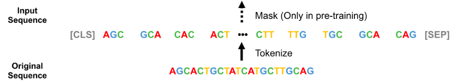